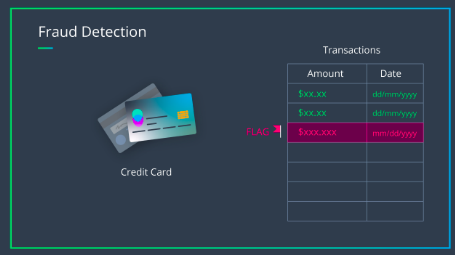

# Detecting Payment Card Fraud

# Project :

 - In this section, we'll look at a credit card fraud detection dataset, and build a binary classification model that can identify transactions as either fraudulent or valid, based on provided, historical data. In a 2016 study, it was estimated that credit card fraud was responsible for over 20 billion dollars in loss, worldwide. Accurately detecting cases of fraud is an ongoing area of research. 

  

 
 # About me :
 
 I am an electrical engineer turned data scientist who loves leveraging data-driven solutions that make an impact on business and society. My first encounter with data science occurred when I worked as a student researcher at the Applied Computational Intelligence Laboratory (Fluminense Federal University) in which I built Artificial Neural Network models for power forecast.

Thereafter, I won a scholarship that allowed me to study at the University of Toronto in Canada. After this experience, I was given the opportunity to work with electrical projects and project management in a small company in Rio de Janeiro, Brazil. My third working contract involved tasks related to the project management of two electrical substation construction projects in a multinational company.

Right now, I’m currently working on projects related to machine learning and data science which includes customer segmentation, sales prediction and marketing campaign response ( Identify potential customers).
 

